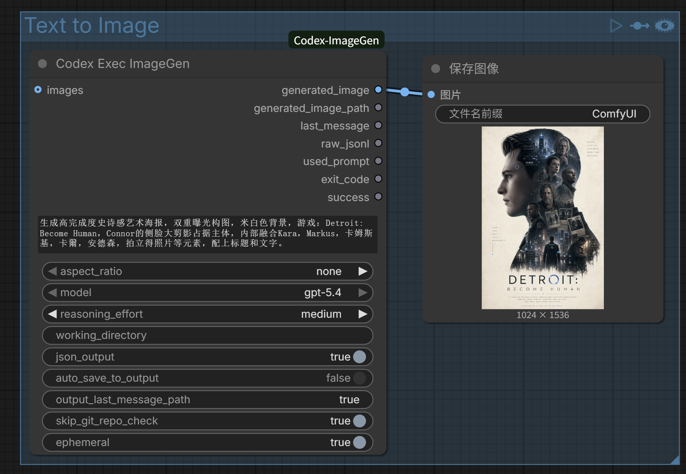
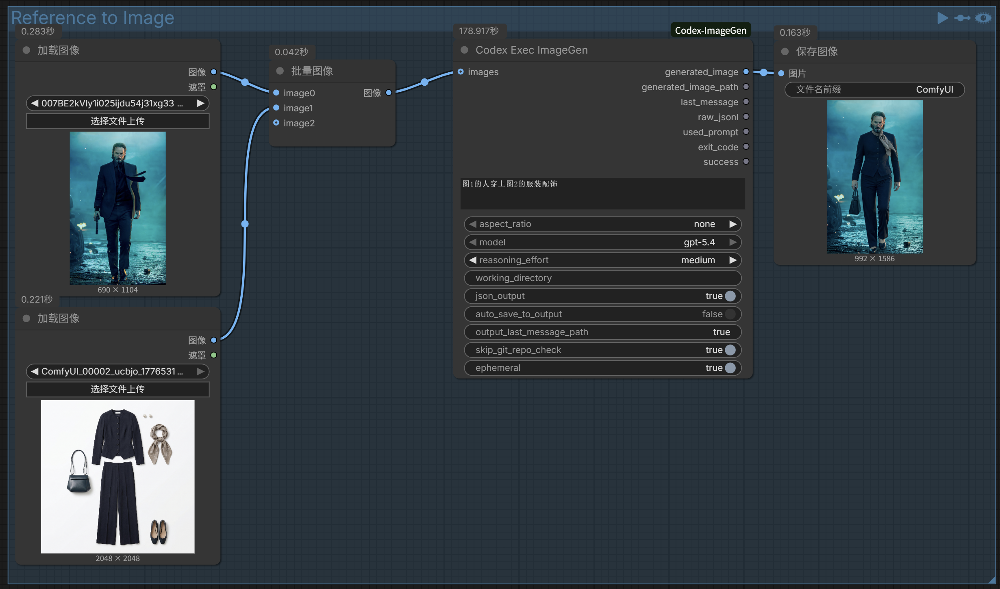
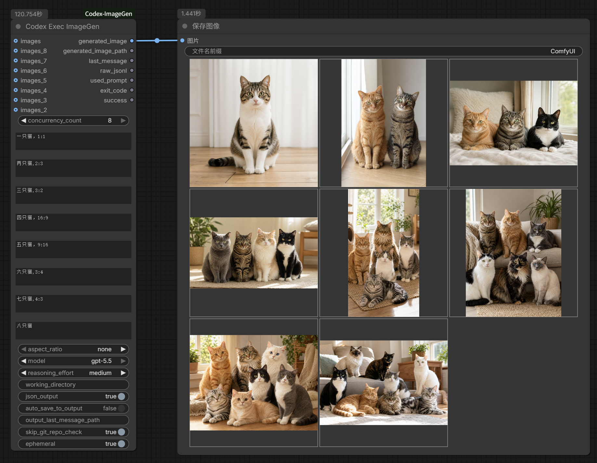
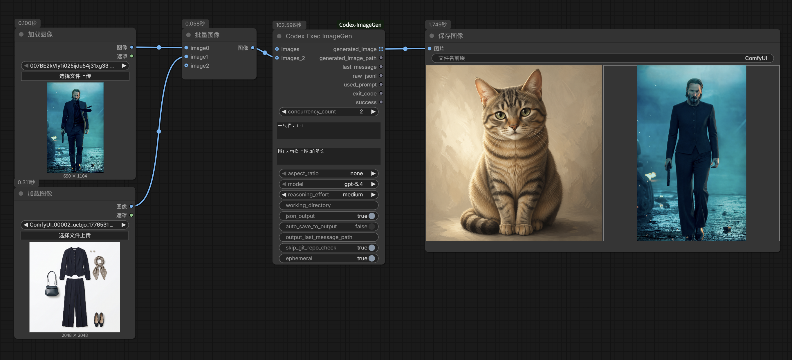

# ComfyUI-Codex-ImageGen

这是一个 ComfyUI 自定义节点，用于通过官方 Codex CLI 的 `codex exec` 在后台执行图片生成或图片编辑任务。

本节点只暴露开发计划中列出的 Codex CLI 官方能力，不添加扩散模型参数。不会提供 seed、steps、cfg、sampler、scheduler、checkpoint、vae、controlnet、lora、latent、image_count 等字段。

## 工作流演示

### Text to Image



### Reference to Image



示例工作流文件见 [`workflow/ImageGen example.json`](workflow/ImageGen%20example.json)。

## 安装方式

### 方式一：ComfyUI Manager 安装

打开 ComfyUI Manager，搜索：

```text
Codex ImageGen
```

或搜索节点 ID：

```text
codex-imagegen
```

安装完成后重启 ComfyUI。

### 方式二：手动 git clone 安装

进入 ComfyUI 的 `custom_nodes` 目录：

```bash
cd ComfyUI/custom_nodes
```

克隆本仓库：

```bash
git clone https://github.com/DocWorkBox/ComfyUI-Codex-ImageGen.git
```

然后重启 ComfyUI。节点会显示在：

```text
Codex/ImageGen -> Codex Exec ImageGen
```

## 前置条件

- Python 3.10+
- ComfyUI
- 已安装 Codex CLI，并且 ComfyUI 进程可以从 `PATH` 中找到 `codex`
- 当前系统用户已经完成 Codex CLI 登录

## Codex CLI 官方安装方式

官方 Codex CLI 仓库 README 给出的全局安装命令是：

```bash
npm install -g @openai/codex
```

macOS 也可以使用 Homebrew：

```bash
brew install --cask codex
```

安装后运行：

```bash
codex
```

官方安装文档列出的系统要求包括 macOS 12+、Ubuntu 20.04+/Debian 10+，或 Windows 11 via WSL2。Git 2.23+ 是可选但推荐安装的依赖。

官方文档链接：

- Codex CLI README：https://github.com/openai/codex
- Codex install.md：https://github.com/openai/codex/blob/main/docs/install.md

可以手动检查登录状态：

```bash
codex login status
```

如果尚未登录，可以执行：

```bash
codex login
```

节点使用插件自己的隔离 `CODEX_HOME`：

```text
runtime/codex_home/
```

这样不会读取你系统用户目录下的 Codex skills、plugins、config 或 rules，避免 Feishu 等无关插件拖慢或污染执行。Codex CLI 可执行文件仍使用系统已安装的 `codex`。

节点执行前会在这个隔离环境中运行 `codex login status`。如果检测到未登录，会尝试执行 `codex login`，Codex CLI 会按官方流程打开浏览器授权页；如果失败，再回退到 `codex login --device-auth`。首次运行通常需要单独授权一次。

## 节点输入与选项说明

- `prompt`：必填，多行文本。填写图片生成或图片编辑任务描述。节点内部会自动包装为：

```text
$imagegen <你的 prompt>
```

如果选择了 `aspect_ratio`，会变成 `$imagegen 画面比例 <比例>。<你的 prompt>`。这里刻意使用单行格式，贴近 Codex CLI 中可直接生图的 `$imagegen 画一只猫` 用法。

- `concurrency_count`：并发任务数量。可选 `1` 到 `8`，默认 `1`。选择大于 `1` 时，节点会显示对应数量的 `prompt_n` 和 `images_n` 输入项，并在后台同时启动多个 `codex exec` 任务。
- `images`：可选图片输入端口，类型为 ComfyUI `IMAGE`。可以从上游节点接入一张或一批图片。节点会把接入的图片保存到 ComfyUI 自身的 `input` 目录，再通过 Codex CLI 的 `--image` 参数传入。
- `prompt_2` 到 `prompt_8`：并发任务 2 到 8 的提示词。只有当 `concurrency_count` 选到对应数量时才需要填写。
- `images_2` 到 `images_8`：并发任务 2 到 8 的参考图输入。每组任务会使用自己的提示词和参考图独立执行。



同时进行生图及参考生图工作：



- `aspect_ratio`：图片比例提示。可选 `none`、`1:1`、`16:9`、`9:16`、`4:3`、`3:4`、`3:2`、`2:3`，默认 `none`。该选项不会映射成 Codex CLI 参数，也不会添加 `--aspect-ratio`；选择具体比例时，只会在 prompt 中加入 `画面比例 <比例>`。
- `model`：Codex 模型选择。可选 `gpt-5.4`、`gpt-5.5`，默认 `gpt-5.4`，用于映射 Codex CLI 的 `--model / -m`。
- `reasoning_effort`：推理强度，映射 `-c model_reasoning_effort=<low|medium|high>`。可选 `low`、`medium`、`high`，默认 `medium`。
- `working_directory`：Codex 执行目录，映射 `--cd / -C`。为空时使用 ComfyUI 自身的 `output` 目录，便于生成图片直接进入 ComfyUI 输出目录；填写时必须是已存在目录。
- `json_output`：是否启用 Codex CLI 的 `--json` 输出。启用后 stdout 会保存为 JSONL 文本并通过 `raw_jsonl` 输出。
- `auto_save_to_output`：是否由本节点自动把生成图复制到 ComfyUI `output` 目录，默认关闭。通常建议关闭，并把 `generated_image` 接到 ComfyUI 自带的“保存图像”节点；否则会出现“本节点保存一张 + 保存图像节点再保存一张”的重复文件。打开后，`generated_image_path` 会返回复制到 `output` 的图片路径。
- `output_last_message_path`：最终消息保存路径，映射 `--output-last-message / -o`。为空时写入本次任务目录下的 `last_message.txt`。
- `skip_git_repo_check`：是否传入 `--skip-git-repo-check`。默认启用，方便在非 Git 目录中执行。
- `ephemeral`：是否传入 `--ephemeral`。默认启用，使本次 Codex 执行不依赖长期会话状态。

沙盒模式不在 UI 中暴露。节点内部固定使用 `--sandbox danger-full-access`，因为 `$imagegen` 通常需要网络访问和写入图片文件权限。

## 节点输出

- `generated_image`：图片输出端口，类型为 ComfyUI `IMAGE` list。单任务时输出 1 个 list item；并发任务时按任务编号顺序输出多个 list item。下游普通“保存图像”节点会对每个 item 分别执行，因此不同尺寸图片不需要补边，也不会产生黑边。
- `generated_image_path`：当 `auto_save_to_output=true` 时，返回复制到 ComfyUI `output` 目录后的图片路径；并发任务会用换行分隔多条路径。默认不自动保存时返回空字符串，避免返回已经清理的临时图路径。
- `last_message`：Codex `-o` 输出文件内容；并发任务会按 `[1]`、`[2]` 等编号合并。如果执行失败，则返回可读错误信息。
- `raw_jsonl`：启用 `json_output` 时保存的 stdout JSONL 原文；并发任务会按编号合并。
- `used_prompt`：实际发送给 Codex 的最终 prompt，包含 `$imagegen`；并发任务会按编号合并。
- `exit_code`：全部任务成功时为 `0`。任一任务失败时节点会直接报错。
- `success`：全部任务成功时为 `true`。任一任务失败时节点会直接报错。

## 进度显示

节点会使用 ComfyUI `ProgressBar` 显示阶段式估算进度。进度来自 Codex CLI JSONL 事件，不是 Image API 的真实百分比：

- 5%：节点开始准备
- 15%：隔离 Codex 登录检查完成
- 20%：`codex exec` 子进程启动
- 35%：Codex turn started
- 55%：识别到 `$imagegen`
- 70%：Codex 开始执行命令
- 80%：命令执行完成
- 90%：Codex turn completed
- 95%：节点解析到生成图片
- 100%：图片已解析并可返回

因此它能表示“当前走到哪个阶段”，但不能表示图片模型内部真实生成了百分之多少。

## 运行时文件

每次执行都会创建独立任务目录，用于保存日志、prompt 和元信息：

```text
runtime/<timestamp>_<uuid>/
├─ stdout.jsonl
├─ stderr.txt
├─ last_message.txt
├─ prompt.txt
└─ meta.json
runtime/codex_home/
```

其中：

- 输入图片不再保存到插件自己的 `runtime/<task>/inputs`，而是保存到 ComfyUI 自身的 `input` 目录。
- 输出图片不再依赖插件自己的 `runtime/<task>/outputs`。节点会优先从 `last_message` 中解析明确图片路径，并扫描 ComfyUI 自身的 `output` 目录和隔离 Codex Home 下的 `generated_images`。
- 默认情况下，图片生成在 `runtime/codex_home/generated_images/` 后，节点会读取为 `IMAGE` 输出，并删除本次读取的源图文件；仅在当前线程目录已经为空时删除该线程目录，不会向上递归删除目录，避免多个节点并发运行时误删其他任务目录。
- 如果 `auto_save_to_output=true`，节点会额外复制一份到 ComfyUI `output` 目录，文件名格式为 `codex_imagegen_<task>_<原文件名>`，并在复制成功后删除本次复制的源图文件。
- 为避免误判旧图片或下游保存节点生成的占位图，扫描 ComfyUI `output` 时只接受本次 `codex exec` 启动之后产生的图片。
- `stdout.jsonl` 保存 `codex exec --json` 的标准输出。
- `stderr.txt` 保存标准错误和本地错误信息。
- `last_message.txt` 保存 `-o` 指定的最终消息。
- `prompt.txt` 保存实际发送给 Codex 的 prompt。
- `meta.json` 保存本次执行的命令摘要和路径信息。
- `runtime/codex_home/` 是隔离的 Codex Home，用于保存该节点专用的登录状态和 Codex 运行数据。
- 成功生成并读取图片后，本次 `runtime/<timestamp>_<uuid>/` 任务目录会自动删除，避免日志文件长期累积。失败、超时或未解析到图片时会保留任务目录，方便查看 `stdout.jsonl`、`stderr.txt`、`last_message.txt` 和 `meta.json`。

## 已实现阶段

- Phase 1：节点注册、prompt 输入、调用 `codex exec`、返回结果元组。
- Phase 2：支持 ComfyUI `IMAGE` 图片端口、model、reasoning effort、固定 `danger-full-access` sandbox、ephemeral、skip git repo check。
- Phase 3：支持登录状态检测、`codex login` 和 `--device-auth` 回退。
- Phase 4：支持独立任务目录、prompt/stdout/stderr/last-message 文件保存、输出图片路径解析。
- Phase 5：支持 Codex CLI 缺失、输入文件缺失、工作目录无效、超时、非 0 退出码等错误的结构化返回。

## 测试

运行：

```bash
python3 -m pytest -s tests/test_codex_node.py
```

当前单元测试覆盖：

- `$imagegen` prompt 自动包装
- `aspect_ratio` 作为 prompt 辅助写入，不作为 CLI 参数
- 命令拼装不包含非官方扩散参数
- 输入图片缺失时报错
- 图片张量保存到 ComfyUI input 目录
- 从 `last_message` 解析输出图片路径
- 扫描 ComfyUI output 目录解析输出图片路径
- Codex JSONL 事件到 ComfyUI 阶段式进度的映射
- Codex CLI 不存在时返回结构化失败
- ComfyUI 节点输入输出契约

## 常见问题

点击运行后没有重新执行

节点已经标记为 `NOT_IDEMPOTENT`，并通过 `IS_CHANGED` 禁用缓存复用。修改插件代码后必须重启 ComfyUI，确保加载的是最新节点代码。

输出 1x1 空图

旧版本在失败时会返回 1x1 占位图。当前版本已改为失败时报错。重启 ComfyUI 后再次运行，如果仍失败，请查看节点错误信息，以及本插件 `runtime/<timestamp>_<uuid>/stderr.txt`、`last_message.txt`、`meta.json`。

运行成功但没有生成图

如果 ComfyUI 显示 `Prompt executed`，但没有可用图片，请检查最近一次 `runtime/<timestamp>_<uuid>/last_message.txt` 和 `stdout.jsonl`。如果里面是 `$imagegen` 的使用说明，说明 Codex CLI 运行成功但 imagegen 没有执行实际生成。当前节点会把 prompt 包装为 `$imagegen <你的 prompt>` 单行格式，修改插件后请重启 ComfyUI 再运行。

`当前环境是只读沙箱，且网络受限，调用 OpenAI Image API 被策略拦截`

说明 `$imagegen` 已经被调用，但 Codex 执行环境没有足够权限访问网络或写入图片。当前节点已经固定传入 `--sandbox danger-full-access`；如果仍被拦截，请确认启动 ComfyUI 的终端中 Codex CLI 本身可以联网，并检查代理/VPN/防火墙是否对该进程生效。

首次运行弹出 Codex 登录授权页

这是预期行为。节点使用独立 `runtime/codex_home`，不会复用你系统默认 `C:\Users\<用户名>\.codex` 的登录状态。按浏览器授权流程登录一次后，后续会复用该隔离环境的登录状态。

`failed to load skill ... feishu-plugin ...` 或执行 600 秒超时

这是 Codex CLI 在启动会话时加载本地插件/技能或请求服务端时卡住。当前节点使用隔离 `CODEX_HOME`，正常情况下不会加载系统用户目录下的 Feishu 插件。修改插件后请重启 ComfyUI；如果仍然超时，请在启动 ComfyUI 的同一终端里运行 `codex exec --skip-git-repo-check "$imagegen 画一只猫"` 检查 Codex CLI 本身是否稳定。

`Codex CLI is not installed or not in PATH.`

说明 ComfyUI 进程无法找到 `codex`。这通常不是 Codex 没安装，而是启动 ComfyUI 的环境变量 `PATH` 和终端不同。

节点会按以下顺序查找 Codex CLI：

1. `CODEX_CLI_PATH` 环境变量
2. 当前 `PATH` 中的 `codex`
3. 常见 Codex 安装路径，例如 Windows npm 的 `%APPDATA%\npm\codex.cmd`、WSL 下的 `~/.codex/bin/wsl/codex`

如果你是 Windows 原生 ComfyUI，先在 PowerShell 或 CMD 里检查：

```bat
where codex
codex --version
```

如果 `where codex` 找不到，通常需要在 Windows 环境安装 Codex CLI：

```bat
npm install -g @openai/codex
```

如果 `where codex` 能找到，但 ComfyUI 仍找不到，可以在启动 ComfyUI 前设置 `CODEX_CLI_PATH`。PowerShell 示例：

```powershell
$env:CODEX_CLI_PATH="C:\Users\47575\AppData\Roaming\npm\codex.cmd"
python main.py
```

如果你是 WSL 里的 ComfyUI，可以设置为 WSL 路径：

```bash
export CODEX_CLI_PATH=/mnt/c/Users/47575/.codex/bin/wsl/codex
python main.py
```

`Codex CLI is not logged in.`

请使用启动 ComfyUI 的同一个系统用户执行：

```bash
codex login
```

`Input image path does not exist`

说明内部路径校验遇到了无效图片文件。当前节点 UI 的 `images` 是 ComfyUI 图片端口，正常工作流中通常不需要手写图片路径。

`Working directory does not exist`

说明 `working_directory` 指向的目录不存在。可以留空，让节点自动使用 ComfyUI output 目录，或填写一个已存在的目录。
